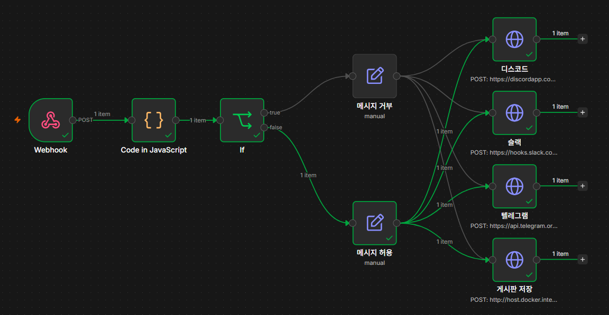
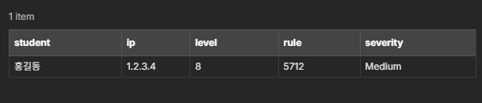
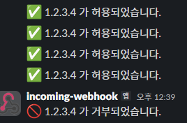
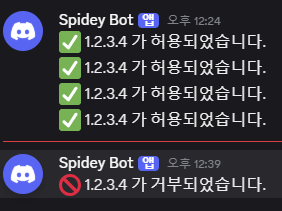
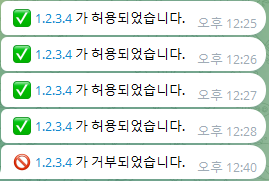
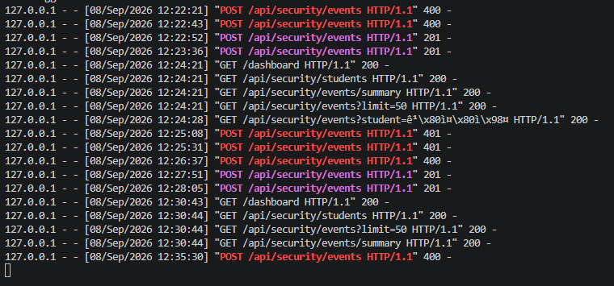
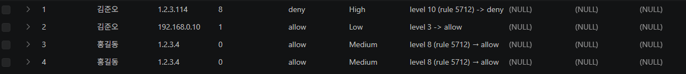
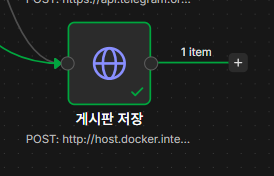

# 로그인 경보 자동화 봇

## ① 무엇을 만들었는지

파이썬이 보낸 로그인 경보를 **n8n이 레벨에 따라 자동으로 허용/거부 판정**하고, 판정 결과를 **슬랙·디스코드·텔레그램 3곳에 알림**으로 보내면서, 동시에 **게시판 REST API를 통해 MySQL에 기록**하는 자동화 봇입니다. 사람이 로그를 일일이 확인하지 않아도 의심스러운 로그인 시도를 실시간으로 감지하고 기록·통보하는 것이 목표입니다.

## ② 작업 내역

작업 순서는 다음과 같습니다.

1. **파이썬 전송기 (`alert_sender.py`)** 작성 — 경보 목록(ip, level, rule 등)을 JSON으로 만들어 n8n Webhook으로 POST. 전송 실패 시에도 프로그램이 죽지 않도록 예외 처리 포함.
2. **n8n Webhook 노드**로 파이썬이 보낸 데이터 수신.
3. **n8n Code 노드**에서 판정 로직 구현 — `level >= 10`이면 `severity: High / decision: deny`, `level >= 7`이면 `Medium / allow`, 그 외는 `Low / allow`로 분류하고 `reason` 문자열 생성.
4. **n8n IF 노드**로 `decision`이 `deny`인 것과 `allow`인 것을 두 갈래로 분기.
5. 각 브랜치에서 **문구 생성** — 거부는 🚫로 시작, 허용은 ✅로 시작하는 다른 형식의 메시지 작성.
6. **슬랙 · 디스코드 · 텔레그램** 3개 메신저로 알림 발송 (양쪽 브랜치 모두).
7. **Flask 게시판 서버**에 보안 이벤트 저장용 REST API 구현
   - `POST /api/security/events` — `X-API-Key` 헤더로 인증, 필수값 검증 후 MySQL `security_events` 테이블에 저장, 성공 시 `201`
   - `GET /api/security/events?student=<이름>` — 인증 없이 본인 기록 최신순 조회
8. **n8n → Flask API 연동** — n8n 컨테이너에서 호스트의 Flask 서버로 접근해야 하므로 `http://host.docker.internal:5000` 주소 사용. 두 브랜치(거부/허용) 모두 저장 노드로 연결하여 MySQL에 기록.

**사용한 기술**
- Python 3 (`urllib` 기반 HTTP 요청)
- n8n (Webhook, Code, IF, HTTP Request 노드)
- Flask + SQLAlchemy (REST API)
- MySQL (Docker 컨테이너, `security_events` 테이블)
- Slack / Discord / Telegram Webhook

## ③ 기능 구현 화면

> 아래 이미지는 `images/` 폴더에 넣고 파일명을 맞춰주세요.

**n8n 워크플로우 전체 화면**

**Code 노드 판정 결과 (아이템 2개, decision/severity/reason 확인)**

**메신저 알림 도착 화면**

**게시판 REST API 테스트 결과 (401 / 400 / 201)**

**MySQL 저장 결과**

**n8n Executions — 게시판 저장 노드 성공(201)**

## ④ 실행 방법

1. **켜는 것**
   - Docker Desktop 실행 → MySQL, n8n 컨테이너 기동 (`docker ps`로 확인)
   - `.env` 파일 준비 (`.env.example` 복사 후 `DATABASE_URL`, `SECURITY_API_KEY` 값 채우기)
   - Flask 게시판 서버 실행: `python app.py` (`http://localhost:5000`)
2. **실행하는 것**
   - `python alert_sender.py` 실행 → n8n Webhook으로 경보 전송
3. **통과 화면**
   - 터미널에 `[n8n] POST ... -> 200` 출력
   - 슬랙/디스코드/텔레그램에 거부(🚫)·허용(✅) 메시지 각각 도착
   - MySQL `security_events` 테이블에 `SELECT * FROM security_events;`로 조회 시 새 레코드 확인
4. **안 될 때 보는 곳**
   - n8n **Executions** 탭에서 어느 노드가 빨간색(실패)인지 확인
   - Flask 서버 콘솔 로그에서 응답 상태 코드(401/400/201) 확인
   - `X-API-Key` 값이 `.env`와 n8n 헤더 설정에서 동일한지 확인

## ⑤ 막혔던 점과 해결 방법

1. **n8n 컨테이너에서 Flask 서버(localhost:5000)에 연결이 안 됨**
   - 원인: n8n이 Docker 컨테이너 안에서 실행되는데, 컨테이너 안에서 `localhost`는 컨테이너 자신을 가리킴
   - 해결: URL을 `http://host.docker.internal:5000`으로 변경하여 호스트 PC의 Flask 서버에 접근하도록 수정

2. **API 키를 넣었는데도 계속 401(Authorization failed)이 뜸**
   - 원인: n8n Header 값에 `{{ $env.SECURITY_API_KEY }}`를 사용했는데, 이 환경변수는 n8n 컨테이너가 아니라 Flask `.env`에만 정의되어 있어 빈 값이 전달됨
   - 해결: n8n 컨테이너 환경변수에 동일한 키를 직접 등록(`docker-compose.yml`의 `environment`)하거나, 테스트 단계에서는 Header Value에 실제 키 값을 직접 입력하여 확인 후 안전한 방식으로 교체

3. **정상적으로 헤더 인증은 통과했는데 400(Bad request) 에러가 남**
   - 원인: n8n Body Parameters의 필드 이름에 오타 발생 (`scr_ip` → `src_ip`, `serverity` → `severity`). Flask가 정확한 필드명(`src_ip`, `decision`, `severity` 등)을 기준으로 필수값을 검사하기 때문에 오타난 필드는 없는 것으로 처리되어 400 에러 발생
   - 해결: Body Parameters의 필드명을 Flask 컨트롤러가 기대하는 이름과 정확히 일치하도록 수정 후 재실행하여 201 확인
